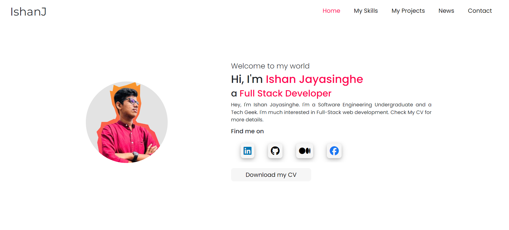
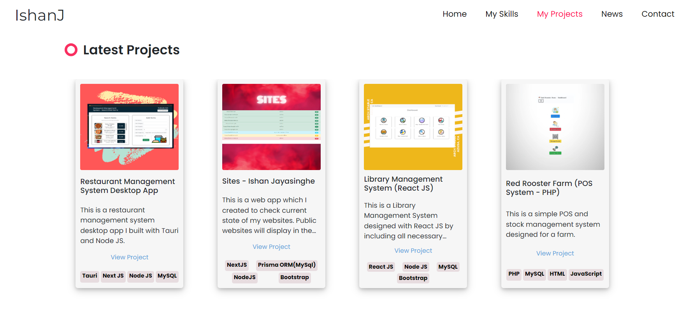
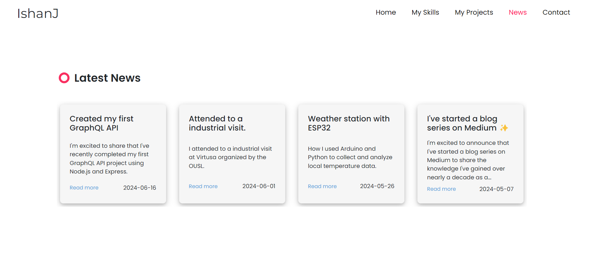

# Ishan's Portfolio Website



Welcome to the GitHub repository for my personal portfolio website, [ishanj.lk](https://ishanj.lk)
. This site showcases my expertise, recent projects, news about my activities, and provides a way to contact me.

## Features
* Social Links: Quick access to my profiles on various social platforms.
* Expertise: Information on my areas of expertise.
* Projects: A dynamically updated list of my most recent projects.
* News: Latest updates about my activities.
* Contact Form: A form to send me an email directly from the website.
* API Integration: Projects and news are dynamically updated using a custom API.
* Smooth Interface: Implement smooth scroll experience with snap-scroll.
* Responsive menu links - Menu links are dynamically highlight to indicate which section user is visiting.
* Responsive design : The webpage responsive for wide range of display sizes including mobiles and tablets.

## Screenshots




## Installation
To get a local copy up and running, follow these simple steps.<br><br>
1. Clone git repository
```bash
git clone https://github.com/ishanj-lk/ishanj-lk2024.git
```

2. Move into folder
```bash
cd ./ishanj-lk2024
```
3. Enjoy development 😊

<br>
<hr/>

### Develop with ❤️ by [Ishan Jayasinghe](https://ishanj.lk).